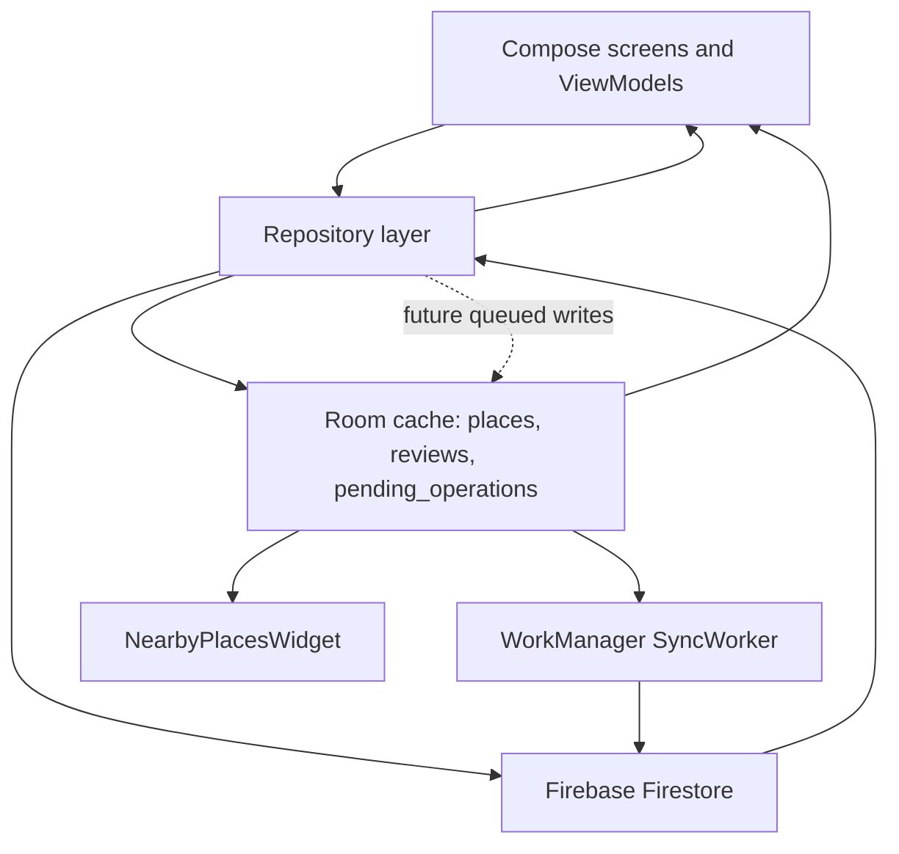
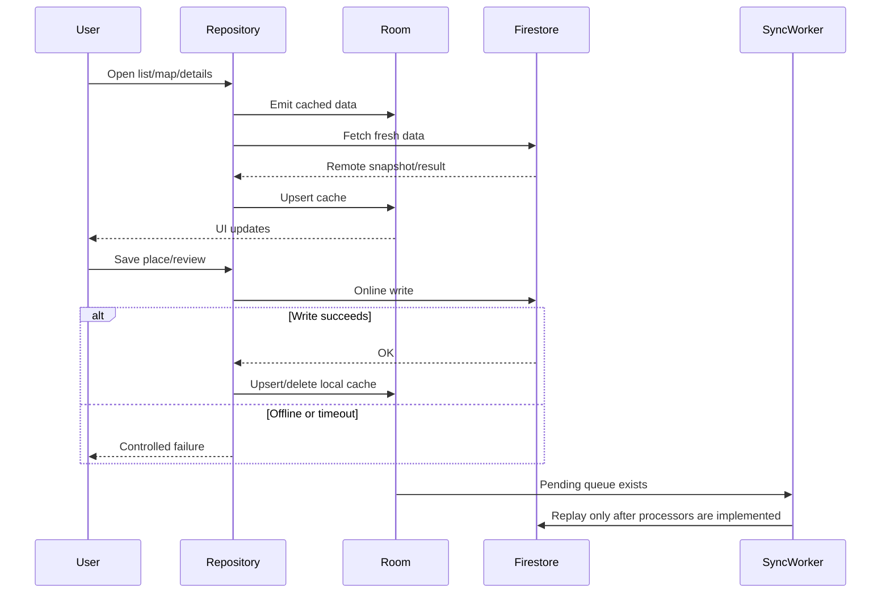

# Android offline mode

Related issue: #306

## Goal

kidZone should stay useful when the network is unavailable or slow. The current implementation
uses Room as a local read cache for public place and review data, keeps Firebase as the source of
truth, and prepares an offline write queue for future write replay.

This document describes the current architecture, the production behavior, the known limitations,
and the manual QA scenarios required before expanding offline-first writes.

## Current production status

| Area | Status | Notes |
| --- | --- | --- |
| Places read cache | Active | Room stores places fetched from Firestore and powers list/map fallbacks. |
| Reviews read cache | Active | Room stores reviews from Firestore snapshot listeners. |
| Nearby widget cache | Active | Widget reads public places from Room and private location from SharedPreferences. |
| Offline writes | Gated | Repositories currently fail user-facing offline writes instead of promising sync. |
| Pending operation queue | Present | Room table and WorkManager worker exist, but write replay is intentionally blocked. |
| Conflict resolution | Partial | Timestamp-based server-wins checks exist for queued updates. |

The important release rule is simple: users may read previously cached data offline, but the app
must not tell users that a place or review was saved offline unless `SyncWorker` actually replays
that write to Firestore.

## Architecture



## Data model

Room database: `KidZoneDatabase`

Tables:

- `places`: local cache for public place data.
- `reviews`: local cache for public review data.
- `pending_operations`: queued write operations for future offline write replay.

DAO responsibilities:

- `PlaceDao` provides list, owner, top, search, map bounds and widget queries.
- `ReviewDao` provides review flows by place and by user.
- `PendingOperationDao` stores pending, failed, in-progress and dead-letter operations.

Room is configured through `DatabaseModule` as `kidzone_cache.db` with destructive fallback
migrations. That is acceptable because the database is treated as a rebuildable cache, not as
the authoritative user data store.

## Read flow

### Places

`FirestorePlaceRepository` reads from Firestore for online fetches and writes successful results
into Room.

Current behavior:

- `observePlaces()` emits from Room.
- `getPlace()` tries Firestore first and falls back to a cached place by id.
- `getPlacesNear()` tries Firestore geohash query and falls back to recent cached places.
- `getTopPlaces()` tries Firestore ranking and falls back to cached top places.
- `getPlacesInBounds()` prefers cached viewport data when available, then queries Firestore.
- `getPlacesPage()` queries Firestore for paged lists and stores returned places in Room.

This gives the Start, lists, map and details screens a useful cached read path after data has
been loaded at least once.

### Reviews

`FirestoreReviewRepository` uses Room as the local stream and Firestore snapshot listeners as the
remote updater.

Current behavior:

- `observeReviewsForPlace()` emits cached reviews for the place and refreshes them from Firestore.
- `observeReviewsByUser()` emits cached reviews for the user and refreshes them from Firestore.
- reported spam is filtered before reviews are written to Room.

## Write flow

Current user-facing write behavior is online-first:

- adding, updating and deleting places writes to Firestore and then updates Room;
- adding, updating and deleting reviews writes to Firestore and then updates Room;
- review writes use a timeout and return a user-facing offline failure if the write cannot finish.

The pending queue exists, but write replay is not considered production-ready yet.

`SyncManager.enqueue()` stores a serialized operation and schedules `SyncWorker` with a connected
network constraint. `SyncWorker` then reads pending and retryable failed operations in FIFO order.

At the moment the processors for add/update/delete place and review operations are gated. They
return failure for replayable writes instead of silently marking them as synced. This protects
data integrity: the app should not lose a queued operation while pretending it was sent.

## Synchronization flow



## Conflict resolution strategy

The queued update path uses a server-wins rule based on `updatedAtMillis`.

For update operations:

1. `SyncWorker` reads `updatedAtMillis` from the server document.
2. If the server timestamp is newer, the local queued update is discarded.
3. If the local timestamp is newer or equal, the worker may apply the local update.
4. If the server document no longer exists, the local queued update is discarded.
5. If the conflict check cannot reach Firestore, the operation stays retryable.

Because replay processors are currently gated, this strategy is documented as the target behavior
for queued updates rather than a complete offline write feature.

## Error handling

| Condition | Expected behavior |
| --- | --- |
| Offline read with cache | Show cached data and keep the app usable. |
| Offline read without cache | Show an empty/error state with retry, not a crash. |
| Firestore timeout during review write | Return a controlled offline failure. |
| Network error during review write | Return a controlled offline failure. |
| Server validation or permission error | Return failure without enqueueing a fake offline success. |
| Auth error | Require sign-in or reauthentication depending on the flow. |
| Worker systemic failure | Retry with WorkManager backoff. |
| Max worker retries | Move operation to dead letter. |

## Offline UX

Expected user-facing behavior:

- Start, lists, map and details can show previously cached places.
- Reviews can show previously cached reviews for already opened places or user review lists.
- The main screen shows the offline status banner when connectivity is unavailable.
- Registration and writes should show clear failure messages when the action requires network.
- The app must not show stale private user data after logout or account deletion.
- The widget must not keep private location state after logout, ban sign-out or account deletion.

## Cache invalidation

Places:

- `KidZoneApplication` deletes stale place cache entries on app start.
- Current TTL: 7 days.
- Place cache can also be cleared through `PlaceDao.clearAll()` when a flow explicitly requires it.

Reviews:

- Review cache is refreshed by Firestore snapshot listeners.
- Reviews for a place are replaced when the place review stream refreshes.
- There is no global TTL for reviews yet.

Widget:

- Widget data comes from public place cache.
- Last widget location is private state and is cleared on sign-out, ban sign-out and account
  deletion.

## Implementation notes

Primary files:

- `app/src/main/java/com/kidzone/data/local/KidZoneDatabase.kt`
- `app/src/main/java/com/kidzone/data/local/PlaceDao.kt`
- `app/src/main/java/com/kidzone/data/local/ReviewDao.kt`
- `app/src/main/java/com/kidzone/data/local/sync/PendingOperationDao.kt`
- `app/src/main/java/com/kidzone/data/local/sync/PendingOperationEntity.kt`
- `app/src/main/java/com/kidzone/data/repository/FirestorePlaceRepository.kt`
- `app/src/main/java/com/kidzone/data/repository/FirestoreReviewRepository.kt`
- `app/src/main/java/com/kidzone/sync/SyncManager.kt`
- `app/src/main/java/com/kidzone/sync/SyncWorker.kt`
- `app/src/main/java/com/kidzone/widget/NearbyPlacesWidget.kt`

Known follow-up:

- Complete production write replay for queued operations or remove unsupported operation types.
- Add explicit UI for pending and failed operations if offline writes become user-facing.
- Add integration tests for worker replay against the Firestore emulator.
- Decide whether logout/delete should also clear public Room place cache, not only private widget
  location state.

## Manual QA checklist

Use a debug or release-candidate build with a test Firebase project.

### Read cache

- [ ] Open Start online and confirm places load.
- [ ] Open place details online and confirm reviews load.
- [ ] Open map online and move the viewport so nearby places are cached.
- [ ] Disable network.
- [ ] Restart the app.
- [ ] Confirm Start shows cached places or a controlled empty state.
- [ ] Confirm list/search does not crash without network.
- [ ] Confirm map shows cached/fallback places or an accessible fallback state.
- [ ] Confirm place details show cached place data when available.
- [ ] Confirm reviews show cached data for places opened before going offline.

### Write behavior

- [ ] Disable network.
- [ ] Try to add a place.
- [ ] Confirm the app shows a controlled failure and does not claim the place was saved.
- [ ] Try to add a review.
- [ ] Confirm the app shows a controlled failure and does not claim the review was saved.
- [ ] Re-enable network.
- [ ] Confirm no phantom place/review appears from a previously failed offline write.

### Privacy and logout

- [ ] Cache places by opening Start/map online.
- [ ] Add the widget and grant location if needed.
- [ ] Log out.
- [ ] Confirm private widget location is cleared and widget refreshes.
- [ ] Confirm no private profile data appears after logout/restart.

### Worker queue

- [ ] If a test build manually seeds `pending_operations`, run with network enabled.
- [ ] Confirm invalid payloads are discarded.
- [ ] Confirm gated replay operations stay failed/retryable and are not marked as synced.
- [ ] Confirm dead-letter behavior after max retries if the operation keeps failing.

## Automated test guidance

For documentation-only changes:

```powershell
git diff --check
```

For future code changes in offline/cache behavior:

```powershell
$env:MAPS_API_KEY="AIzaSyPlaceholder"; .\gradlew.bat testDebugUnitTest
$env:MAPS_API_KEY="AIzaSyPlaceholder"; .\gradlew.bat detekt
```

If Firestore or Storage rules change:

```powershell
cd tests/firestore-rules
npm test
```

## Definition of Done

- [ ] This document is updated when offline cache or sync behavior changes.
- [ ] Read-cache scenarios pass manually on a device or emulator.
- [ ] Offline write UX does not promise a queued sync unless replay is implemented.
- [ ] Widget privacy behavior is verified after logout and account deletion.
- [ ] Any production write replay is covered by unit and emulator tests before release.
